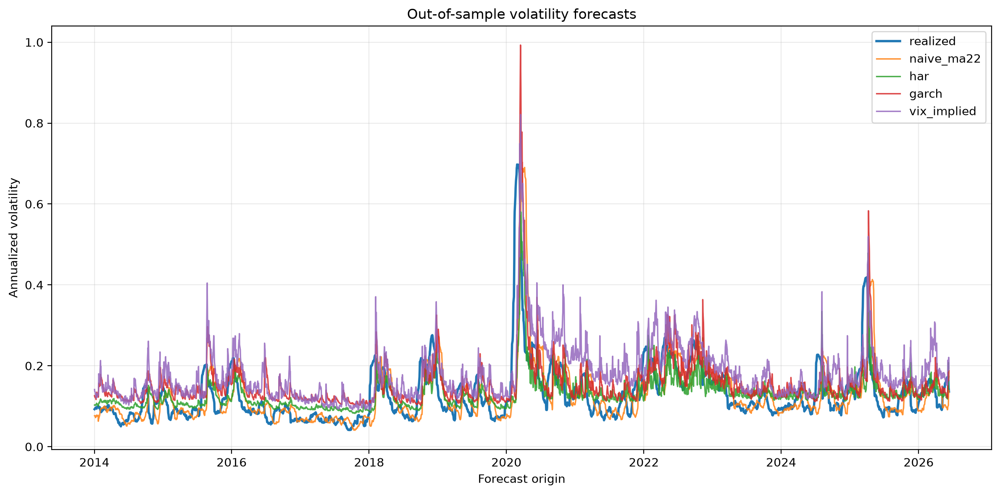
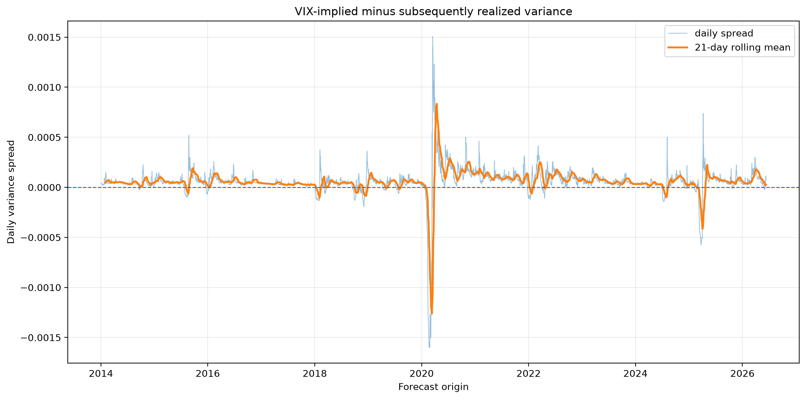

# Archer

Archer is a leakage-safe volatility forecasting research system for the S&P 500. It builds auditable market-data snapshots, estimates realized variance, generates 21-day forecasts from four competing models, and evaluates them through a purged expanding-window walk-forward experiment.

Across **3,129 out-of-sample forecasts from January 2014 through June 2026**, the HAR-RV model reduced mean QLIKE loss by **25.7%** relative to a trailing-month benchmark. The difference was statistically significant under a HAC-adjusted Diebold–Mariano test with `p = 0.0039`.



## Results

Archer forecasts the S&P 500’s average daily variance over the next 21 trading days.

The model lineup is:

* `naive_ma22`: trailing 22-day average realized variance
* `har`: OLS HAR-RV using daily, weekly, and monthly realized variance
* `garch`: Gaussian GARCH(1,1) fitted to daily returns
* `vix_implied`: VIX converted into average daily variance over a matched 21-trading-day horizon

Daily realized variance is estimated with `gk_total`, which combines the squared overnight return with the intraday Garman–Klass estimator.

### Forecast accuracy

Lower loss is better.

| Model       | Mean QLIKE | Improvement vs. naive | Mean MSE | Improvement vs. naive |
| ----------- | ---------: | --------------------: | -------: | --------------------: |
| HAR         |      0.318 |                 25.7% | 2.17e-08 |                 38.0% |
| GARCH       |      0.334 |                 22.1% | 3.18e-08 |                  9.1% |
| VIX implied |      0.394 |                  8.1% | 2.82e-08 |                 19.4% |
| Naive MA22  |      0.428 |                     — | 3.50e-08 |                     — |

HAR produced the lowest mean QLIKE and MSE over the complete out-of-sample period.

The naive forecast remained competitive during many ordinary observations and had the lowest median QLIKE. Its mean loss was worse because it made larger errors around important volatility transitions.

The complete exported tables are available in:

* [`reports/overall_qlike.csv`](reports/overall_qlike.csv)
* [`reports/overall_mse.csv`](reports/overall_mse.csv)
* [`reports/qlike_by_year.csv`](reports/qlike_by_year.csv)
* [`reports/mse_by_year.csv`](reports/mse_by_year.csv)

### Calibration

Mincer–Zarnowitz regressions were estimated as:

```text
realized variance = intercept + slope × forecast + error
```

A perfectly calibrated forecast has an intercept of zero and a slope of one. HAC covariance estimates use 20 lags because adjacent 21-day targets overlap.

| Model       | Intercept | Slope |    R² | Joint calibration p-value |
| ----------- | --------: | ----: | ----: | ------------------------: |
| Naive MA22  |  0.000057 | 0.346 | 0.117 |                    <0.001 |
| HAR         |  0.000021 | 0.869 | 0.202 |                     0.115 |
| GARCH       |  0.000038 | 0.435 | 0.236 |                    <0.001 |
| VIX implied |  0.000008 | 0.543 | 0.270 |                    <0.001 |

HAR was the only model for which the joint null of zero intercept and unit slope was not rejected at the 5% level.

VIX had the highest regression R², indicating that it contains substantial information about subsequent realized variance. Its calibration restriction was nevertheless strongly rejected. VIX was informative, but it was not a consistently calibrated point forecast of realized variance.

The complete calibration output is available in [`reports/mz_calibration.csv`](reports/mz_calibration.csv).

### Pairwise significance

Pairwise Diebold–Mariano tests use QLIKE loss differentials, a HAC estimate of long-run variance with 20 lags, and the Harvey–Leybourne–Newbold finite-sample correction.

The HAR improvement over the naive benchmark was statistically significant:

```text
HAR vs. naive MA22
Mean QLIKE difference: -0.110
p-value: 0.0039
```

A negative loss difference means the first model had lower average loss.

GARCH also reduced average QLIKE relative to the naive forecast, but the difference did not reach the 5% significance threshold:

```text
GARCH vs. naive MA22
Mean QLIKE difference: -0.095
p-value: 0.0889
```

HAR had lower mean QLIKE than both GARCH and VIX, but those pairwise differences were not statistically significant:

```text
HAR vs. GARCH: p = 0.629
HAR vs. VIX:   p = 0.135
```

GARCH significantly outperformed the VIX-implied forecast under QLIKE:

```text
GARCH vs. VIX
Mean QLIKE difference: -0.060
p-value: 0.0060
```

None of the pairwise MSE differences were statistically significant. MSE was heavily influenced by a small number of extreme observations, particularly during the 2020 volatility shock.

The complete test outputs are available in:

* [`reports/dm_qlike.csv`](reports/dm_qlike.csv)
* [`reports/dm_mse.csv`](reports/dm_mse.csv)

### Market regimes

Model performance varied materially across years.

HAR performed particularly well in 2014, 2015, 2019, 2021, 2024, and 2026. It was less effective relative to the naive forecast during calm periods such as 2017 and 2023.

GARCH was especially competitive during turbulent periods. It had the lowest annual QLIKE in 2018 and 2022 and responded strongly during the 2020 volatility shock.

The VIX-implied forecast was also most useful during stress. It had the lowest QLIKE in 2020 and remained competitive in 2018 and 2022, but its point forecasts were less accurate during several lower-volatility years.



The main conclusion is not that one model dominates in every regime. HAR was the strongest general-purpose forecast, while GARCH and VIX contained useful information during abrupt volatility changes.

## Evaluation design

The experiment uses an expanding-window walk-forward design.

| Setting                 |                         Value |
| ----------------------- | ----------------------------: |
| First fit cutoff        |             December 31, 2013 |
| Out-of-sample period    | January 2, 2014–June 11, 2026 |
| Forecast horizon        |               21 trading days |
| Refit frequency         |     Every 21 forecast origins |
| Model refits            |                           149 |
| Out-of-sample forecasts |                         3,129 |

Every model is evaluated on the same dates and in the same daily variance units.

Training rows are purged using the end date of the target window. A row may enter a training fold only when its entire future 21-day target is observable by that fold’s cutoff.

The forecasting models are fitted only inside the walk-forward harness. The resulting prediction panel therefore acts as the single point-in-time record of every out-of-sample forecast.

## Architecture

```text
Public market-data sources
          │
          ▼
Immutable bronze snapshots
          │
          ▼
Cleaning and data-quality gates
          │
          ▼
Canonical silver bars
          │
          ├── adjusted returns
          └── realized-variance estimators
                        │
                        ▼
                 VolDataset
                        │
                        ▼
             Purged expanding folds
                        │
          ┌─────────────┼─────────────┐
          ▼             ▼             ▼
       HAR-RV       GARCH(1,1)    Benchmarks
          └─────────────┼─────────────┘
                        ▼
               PredictionPanel
                        │
          ┌─────────────┼─────────────┐
          ▼             ▼             ▼
       QLIKE/MSE    MZ calibration   DM tests
                        │
                        ▼
                 Committed reports
```

The implementation follows four central research rules:

1. **Point-in-time storage**
   Raw downloads are preserved as timestamped bronze snapshots before cleaning.

2. **Purged walk-forward evaluation**
   Training targets must end on or before the fit cutoff. Future target information cannot cross a fold boundary.

3. **HAC inference**
   Calibration and forecast-comparison statistics account for serial dependence caused by overlapping 21-day targets.

4. **Volatility-appropriate loss**
   QLIKE is the primary loss because it is designed for positive variance forecasts and is less sensitive than MSE to noise in the realized-variance proxy.

## Design decisions

### Immutable raw data

[`src/archer/data/store.py`](src/archer/data/store.py) separates timestamped bronze snapshots from canonical silver datasets. Re-running ingestion does not overwrite the raw evidence used by earlier experiments.

### Data-quality gates

[`src/archer/data/gates.py`](src/archer/data/gates.py) validates uniqueness, chronological ordering, OHLC consistency, nonnegative volume, calendar completeness, plausibility, and known market-event outliers.

Exceptional observations are not silently deleted. Known events can be explicitly whitelisted in [`config/events.yaml`](config/events.yaml).

### Realized variance

[`src/archer/features/realized_vol.py`](src/archer/features/realized_vol.py) implements close-to-close, Parkinson, Garman–Klass, Rogers–Satchell, Yang–Zhang, and overnight-adjusted Garman–Klass estimators.

The forecasting experiment uses `gk_total`:

```text
overnight squared return + intraday Garman–Klass variance
```

This preserves both close-to-open and open-to-close information.

### Leakage-safe targets

[`src/archer/models/dataset.py`](src/archer/models/dataset.py) stores both each forecast origin and the date on which its future target becomes completely observable.

[`src/archer/models/fold.py`](src/archer/models/fold.py) constructs expanding folds from actual observed trading dates and excludes any training row whose target extends beyond the cutoff.

### One walk-forward implementation

[`src/archer/analytics/walkforward.py`](src/archer/analytics/walkforward.py) is the single implementation responsible for model fitting and out-of-sample prediction.

Models do not create their own train/test splits. They receive an explicit fold and must return forecasts on exactly that fold’s test index.

### Statistical evaluation

The evaluation layer includes:

* [`src/archer/analytics/losses.py`](src/archer/analytics/losses.py): QLIKE and MSE
* [`src/archer/analytics/mz.py`](src/archer/analytics/mz.py): Mincer–Zarnowitz calibration
* [`src/archer/analytics/dm.py`](src/archer/analytics/dm.py): Diebold–Mariano forecast comparison
* [`src/archer/analytics/report.py`](src/archer/analytics/report.py): overall and yearly summaries
* [`src/archer/analytics/plots.py`](src/archer/analytics/plots.py): committed research figures

## Reproduction

Archer uses Python and [`uv`](https://docs.astral.sh/uv/) for dependency and environment management.

Install the locked environment:

```bash
uv sync --locked
```

Ingest and validate the configured market data:

```bash
uv run archer ingest
```

Run the test suite:

```bash
uv run pytest -q
```

Run the complete forecasting experiment:

```bash
uv run python scripts/run_forecast_eval.py
```

Generated runtime artifacts are written under `data/evals/`. This directory is intentionally ignored by Git.

Selected figures, summary tables, and the evaluation manifest are copied into [`reports/`](reports/) so the frozen results remain visible and reviewable on GitHub.

## Repository structure

```text
config/                 Data sources, instruments, and event whitelist
reports/                Committed figures and summary tables
scripts/                End-to-end research entry points
src/archer/data/        Ingestion, storage, cleaning, and gates
src/archer/features/    Realized and implied volatility transformations
src/archer/models/      Datasets, folds, forecasts, and benchmarks
src/archer/analytics/   Walk-forward evaluation and statistical inference
tests/                  Unit, invariant, and synthetic-data tests
```

## Limitations

* Archer evaluates statistical volatility forecasts, not a tradable strategy.
* VIX is used as an implied-variance benchmark; VIX itself is not directly investable.
* GARCH currently uses Gaussian innovations.
* The primary experiment uses one 21-day horizon and an expanding training window.
* Cash returns, execution costs, volatility-product mechanics, and portfolio constraints are outside the scope of this release.
* Results are based on public historical data and do not imply future investment performance.

## Roadmap

The `v0.2-forecast` release is intentionally frozen as a volatility forecasting research artifact.

Possible future extensions are scoped separately:

* consume the certified prediction panel in a point-in-time strategy simulator
* compare forecast-conditioned volatility exposure with unconditional risk-premium harvesting
* add next-open execution, turnover costs, volatility targeting, and drawdown controls
* test forecast combinations and regime-dependent weighting
* extend the research layer to volatility term structure and option-surface data

These extensions are not required to reproduce or interpret the forecasting results in this release.
